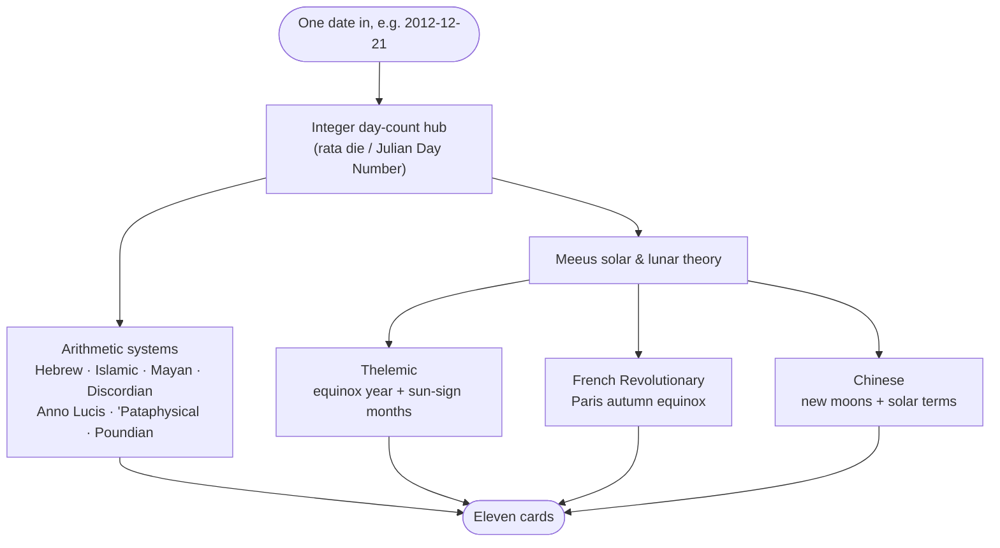
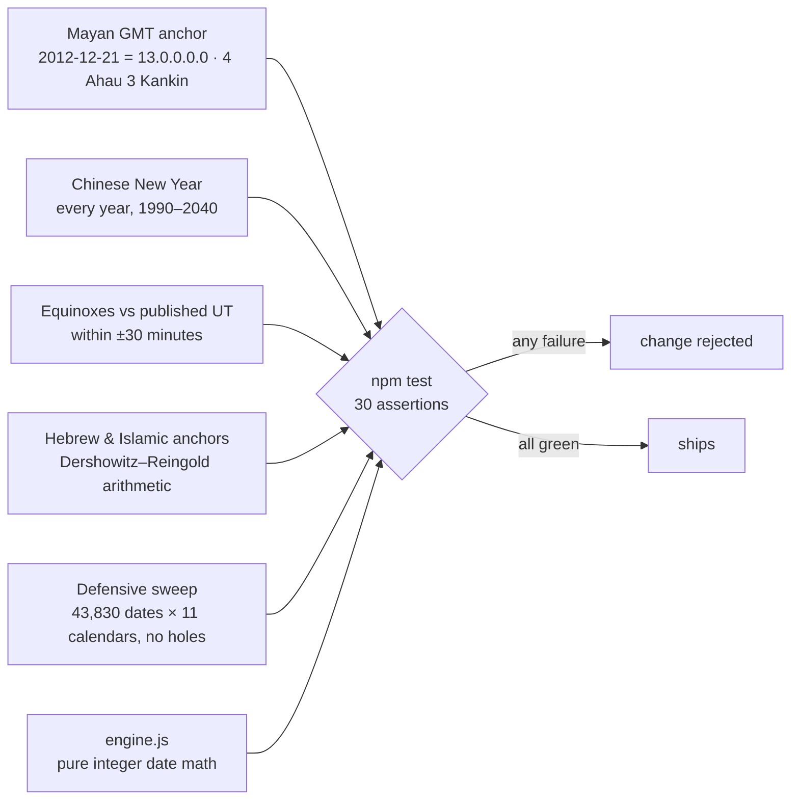

# Eleven Days

> *"How to Live Eleven Days in 24 Hours"* — Robert Anton Wilson

An [Obsidian](https://obsidian.md) plugin that shows any date across **eleven calendar systems at once** — the Gregorian calendar plus ten companions, each carrying its own mythology, its own year zero, its own idea of what time is *for*:

👁️ Anno Lucis · 🍎 Discordian · 🌀 'Pataphysical · 🏛️ Poundian · 👑 Thelemic · 🐓 French Revolutionary · 🌙 Islamic · 🐉 Chinese · ☀️ Mayan · 🕎 Hebrew

Drop one code fence into a note and today fans out into eleven todays. Click any card to read that calendar's story. Add your own annual holidays. If you keep daily notes, the arrows walk you day to day — even after you've archived old notes into nested folders.

## Why eleven calendars?

The name honors a chapter of Robert Anton Wilson's *Cosmic Trigger*, "How to Live Eleven Days in 24 Hours." Wilson liked to date his writing in half a dozen calendars at once — Gregorian, Discordian, Thelemic, Hebrew, Chinese, and onward — not as a party trick but as an exercise in what he called **model agnosticism**: every calendar is a *map* of time, and no map is the territory. The Gregorian date feels like plain reality until it sits next to ten alternatives, each internally consistent, each once (or still) the "obvious" reckoning for millions of people. Watch the same Tuesday register as a day in Confusion 3192, as ☉ in Cancer in the Aeon of Horus, and as 12 Wind on a 260-day sacred round, and the frame quietly loosens.

Two smaller homages hide in the details. The calendar descriptions keep to **E-Prime** — English without any form of "to be" — a discipline Wilson championed for the same map/territory reasons. And July 23 makes a fine first personal holiday (Maybe Day, as Wilson's readers keep it).

## The eleven systems

| | System | Era | Counts from |
|---|---|---|---|
| 📅 | Gregorian | C.E. | the estimated birth of Jesus Christ; Pope Gregory XIII's 1582 reform |
| 👁️ | Anno Lucis | A.L. | 4000 BCE — the Masonic "Year of Light," the first dawn of civilization |
| 🍎 | Discordian | y.C. | 1184 BCE — the Original Snub, when Eris threw the golden apple |
| 🌀 | 'Pataphysical | E.P. | September 8, 1873 — the birth of Alfred Jarry |
| 🏛️ | Poundian | p.s.U. | October 30, 1921 — Joyce finishes the last words of *Ulysses* |
| 👑 | Thelemic | Anno | 1904 — Crowley receives *The Book of the Law*; years turn at the March equinox |
| 🐓 | French Revolutionary | An | September 22, 1792 — the First Republic; years turn at the Paris autumn equinox |
| 🌙 | Islamic | A.H. | 622 C.E. — the Hejira, Muhammad's emigration from Mecca to Medina |
| 🐉 | Chinese | C.C. | 2698 BCE — the legendary ascension of the Yellow Emperor |
| ☀️ | Mayan | M.C. | 3114 BCE — the creation epoch; Long Count, Tzolk'in, and Haab together |
| 🕎 | Hebrew | A.M. | 3761 BCE — Anno Mundi, reckoned from Biblical genealogies |

## Under the hood

All eleven derive from a single integer day-count hub — the *rata die* / Julian Day Number machinery of Dershowitz & Reingold's *Calendrical Calculations* — with compact Meeus astronomy for the systems that genuinely track the sky:



No date libraries, no floating-point drift in the day arithmetic, and every calendar degrades independently — if one system ever failed it would show "—" while the other ten carry on.

## The proof

Pretty cards mean nothing if the math lies. A Node regression suite (`npm test`) pins the engine to independently known anchors, and the whole suite must stay green for any engine change to land:



## Usage

````markdown
```eleven-days
```
````

That renders today. Options go inside the fence, one per line:

````markdown
```eleven-days
date: 1904-04-08
style: mono
color: #8b7cf6
float: true
nav: false
weekly: false
```
````

- `date:` — pin the block to a date (`YYYY-MM-DD`). Without it, a daily note shows *its own* day (parsed from the filename); any other note shows today and rolls over at midnight.
- `style:` / `color:` — override the color style for this block (see below).
- `float: true` — stick the calendar to the top of the scroll view.
- `nav: false` / `weekly: false` — hide the arrows or the weekly link for this block.

`11days` and `calendar` work as fence aliases, and the command palette offers **Insert calendar block**. Click any small card to swap its mythos into the featured banner; the **+** button adds an annual event for that day.

## Color styles

Four ways to tint the cards, set globally in settings or per-block with `style:`:

- **Spectrum** (default) — each system wears its own hue, cascading warm to cool across the grid.
- **Mono** — pick one soft color; the plugin builds a gentle palette around it (a quiet lightness ramp with a whisper of hue drift) so the grid keeps depth without shouting.
- **Warm / cool** — the top row glows warm, the bottom row cool.
- **Weekday** — the whole calendar re-tints each day, cycling seven colors on the classical day-planet correspondences: gold for the Sun's day, silver-blue for the Moon's, scarlet for Mars', yellow for Mercury's, violet for Jupiter's, emerald for Venus', indigo for Saturn's.

## Daily-note navigation (optional)

The ‹ › arrows jump between daily notes **by the date in the filename, not a fixed path**:

1. First they look in the same folder as the current note.
2. Then, direction-aware fallback: a note inside your archive checks the archive (including all subfolders) first, then the live daily folder — and vice versa for live notes. Nested archives like `Archive/2026/Summer/` just work.
3. If the note exists nowhere, clicking creates it in the live daily folder.

The live folder and date format auto-detect from the core **Daily Notes** plugin or **Periodic Notes**; every path can be overridden in settings, and the whole navigation layer switches off cleanly if you move through notes some other way.

## Settings

- Daily-note folder and date format (blank = auto-detect)
- Archive root, searched recursively
- Weekly-note folder + format, with its own toggle
- Color style + mono base color
- Personal holidays: add / remove annual events, or bulk-import from a JSON file shaped like `{"MM-DD": ["Event", …]}`
- First-run setup, re-openable any time

Holidays live in the plugin's own `data.json`, so they travel with whatever syncs your vault.

## Installing

Until the plugin lands in the community catalog, install with [BRAT](https://github.com/TfTHacker/obsidian42-brat) pointed at this repo, or copy `main.js`, `manifest.json`, and `styles.css` from a release into `.obsidian/plugins/eleven-days/`.

## Developing

```bash
npm install
npm run dev     # esbuild watch mode
npm run build   # typecheck + production bundle
npm test        # engine regression suite — keep it green
```

`src/engine.js` holds the calendar math and ports verbatim from its verified original; treat it as read-only unless you extend the test suite first.

## License

MIT
